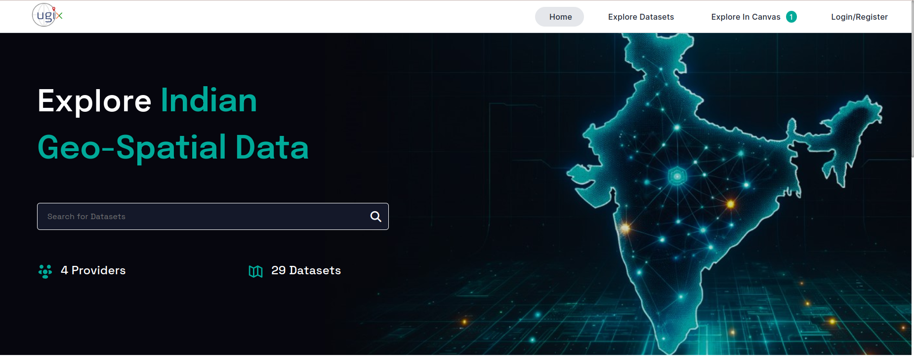
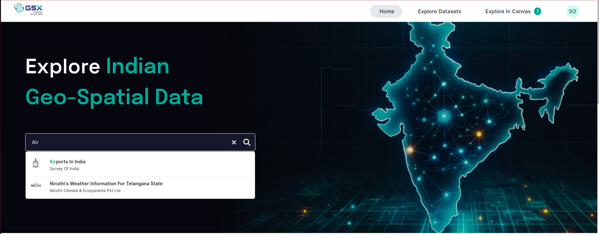
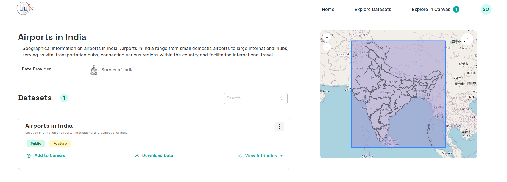

# Discover Resources
With the help of [Catalogue APIs](https://dx.ugix.org.in/cat/apis), a consumer can access information related to availability of a resource using text and geo-based search.

## Using UGIX Catalogue UI

A consumer can use the [Catalogue UI](https://catalogue.ugix.org.in/) to discover resources. 

 
*Catalogue UI*

Using the search for Dataset box, users can perform a free text search. As they type a query, the UI will display a list of search results that can be scrolled through. If users find a resource they are interested in, they can select it by clicking on the corresponding item in the list.

 
*Catalogue Text Search*

The Catalogue Resource Page provides detailed information about a resource, including the provider's information. Users can also explore various dataset attributes, download the dataset, find the dataset ID (also known as the resource ID), and add the dataset to the canvas by clicking the '+' icon.

 
*Catalogue Resource Page*

## Access Policies of a Resource
A resource can be either `Public` or `Restricted`. If a resource is `Public`, it can be accessed via APIs without needing consent from the Provider. For `Restricted` resources, access to APIs requires consent from the Provider.