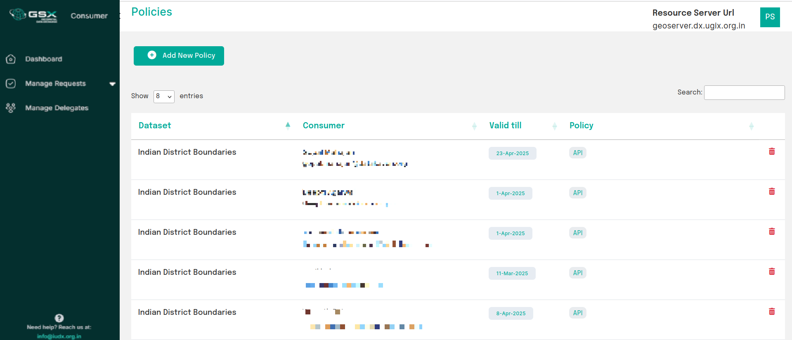
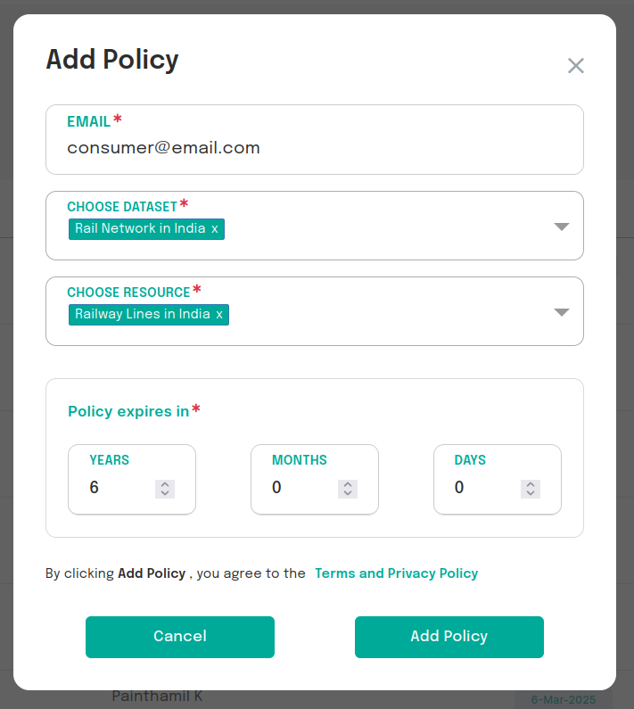

# Manage Policies
Providers can create, view and delete consumer access policies in the Consumers tab.

 
*View policies set for consumers*

Policies can be established for consumers regarding specific resource datasets, including restrictions on access types.
- **API Access** allows consumers to call the GDI Resource Server APIs on the specified resource.

**Note: A policy can only be created if the consumer and the resource/dataset exist in the GDI Catalogue.** Provider can also set an expiry time for the policy. Once a policy expires, the consumer will no longer be able to request tokens for that particular resource.

 
*Create policy*
