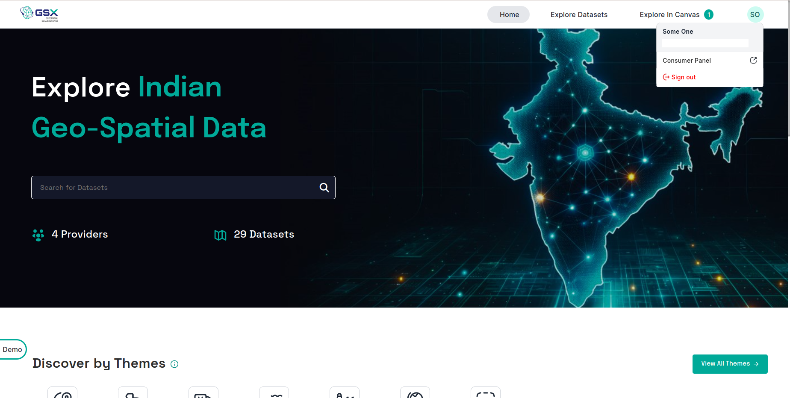
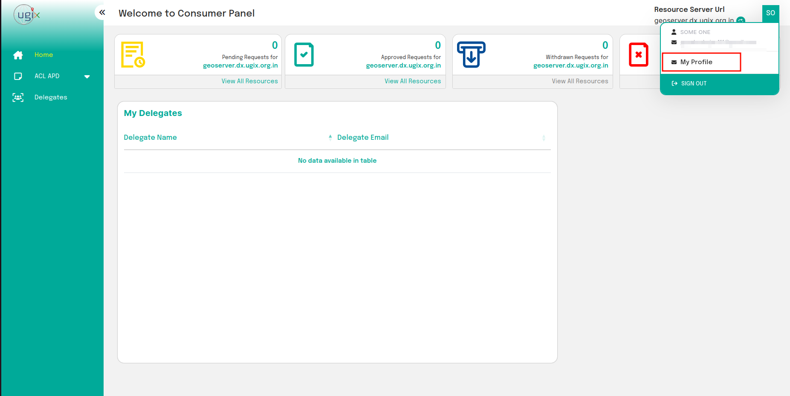
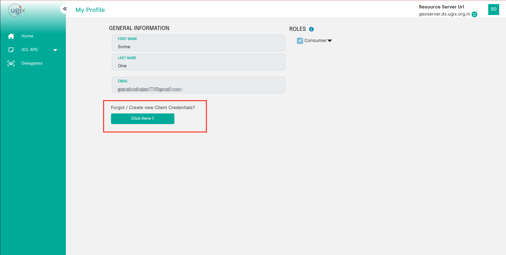
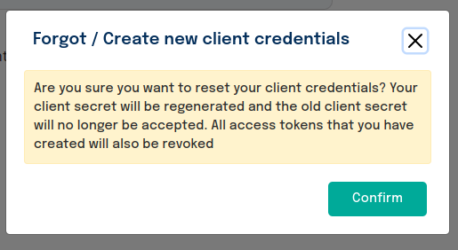
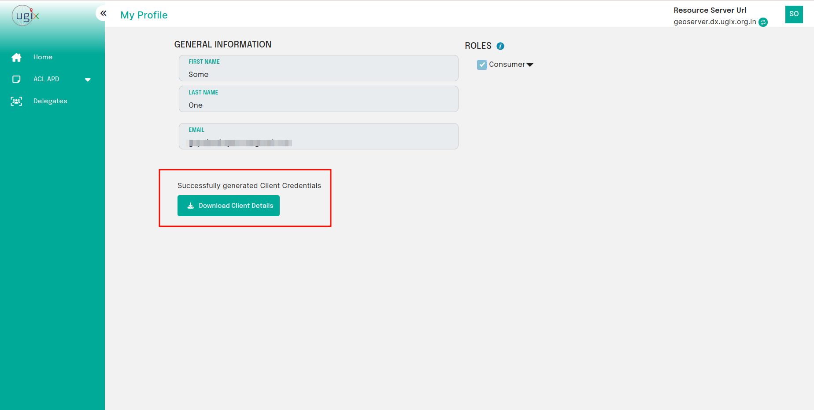

# Fetching and Resetting Client Credentials

Once you have registered as a consumer or have been approved as a provider, you may obtain your default client credentials.

1. Log into the catalogue and click on the top right button to enter your role panel.

 
*Entering into the user panel*

2. In your respective role panel, click on the top right button to enter into your My Profile panel.

 
*Entering into the My Profile panel*

3. In the `My Profile` panel, you can either download your default client credentials or reset them if they're lost or compromised.
 
*Getting new client credentials*

**NOTE : Resetting client credentials will result in revocation of all existing tokens. Additionally, the old client secret will not be accepted in token requests.**

  
*Confirm if you agree*

4. Click on download Client Credentials .csv file.
  
 *Downloading default client credentials*
