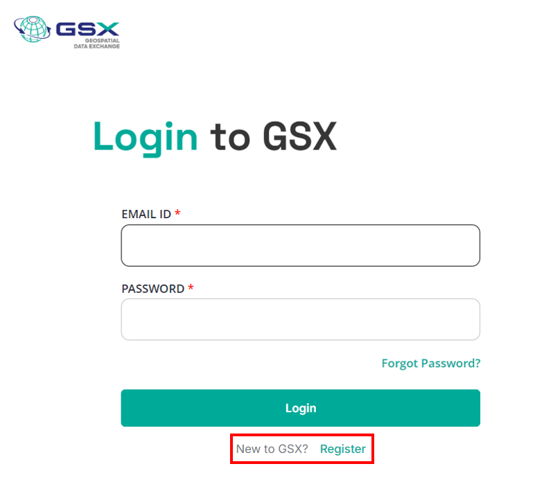
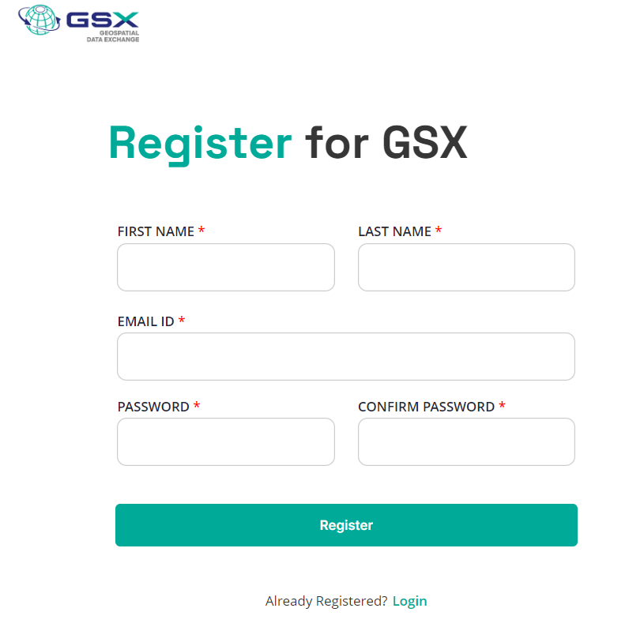
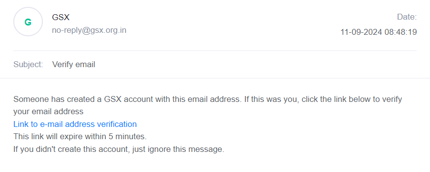

# Registration

## Introduction

All users of the GSX platform must be registered and authenticated to perform any secure operation offered by the platform, which is available at no cost. The details of these secure operations are defined and explained by all GSX components in their respective [API documentation](https://dx.gsx.org.in/apis). The registration process of a user on the GSX platform is a simple three-step process as outlined below:
1. [Creating the Account](#1-account-creation)
2. [Verifying the Email Address](#2-email-verification)
3. [Assigning / Requesting a User Role](#3-requesting-user-roles)

## 1. Account Creation

As the first step when a user accesses the [panel](https://catalogue.gsx.org.in/auth), they need to register as a new user.    Registering is highlighted in the picture.
 
*Click on Register*

 
*Enter Account details*

## 2. Email Verification

The user will receive an email with a verification link at their registered email address. By clicking this link, the user's account will be successfully connected to their email address.

***Note: The verification link will expire in 5 minutes.***

 
*Sample email dialog*

Once your email address has been verified, you will be directed to an interface that looks like this:

 
*Account created! The final registration step of selecting a role is pending.*

## 3. Requesting User Roles

Once email verification is complete, the user can select their desired roles by clicking on the "Complete Profile" button on the subsequent interface. All roles are associated with a resource server to which the role applies. For example:

* Choosing the provider role for the resource server "rs.example.com" allows the user to upload resources to the "rs.example.com" resource server and manage access to those resources.
* Choosing the consumer role for the resource server "rs.example.com" allows the user to request access to resources on "rs.example.com" and access permitted resources on that resource server.

**NOTE: If the user chooses the consumer role, all resource servers are automatically selected, and the user will receive the consumer role for any new resource server that is added.**

 
*Choosing consumer role*

### Provider Registration

Users who need to take on the provider role must provide their organization's details.

**Note: Provider registration is deemed complete only after the resource server admin approves it. Once approved, the provider will gain access to the provider panel. Providers awaiting approval can contact GSX to expedite the approval process.**

 
*Choosing provider role*

 
*Successful provider registration (pending RS admin approval)*
