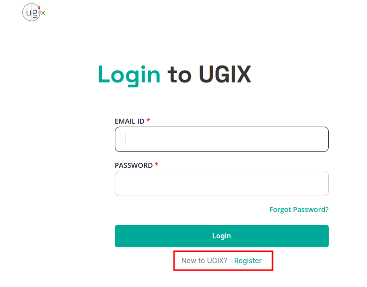
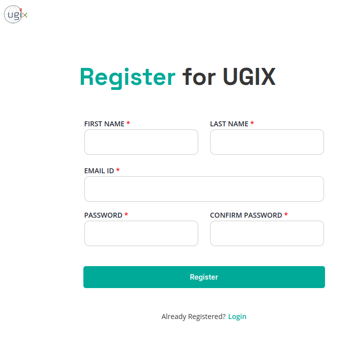
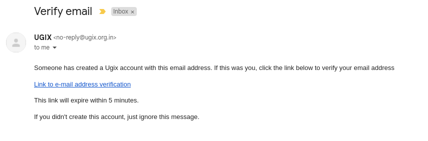
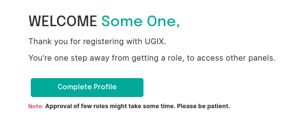
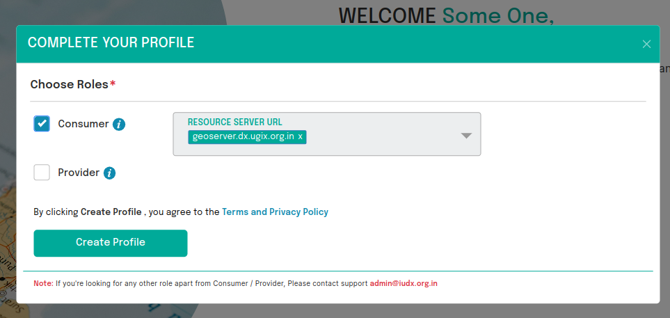
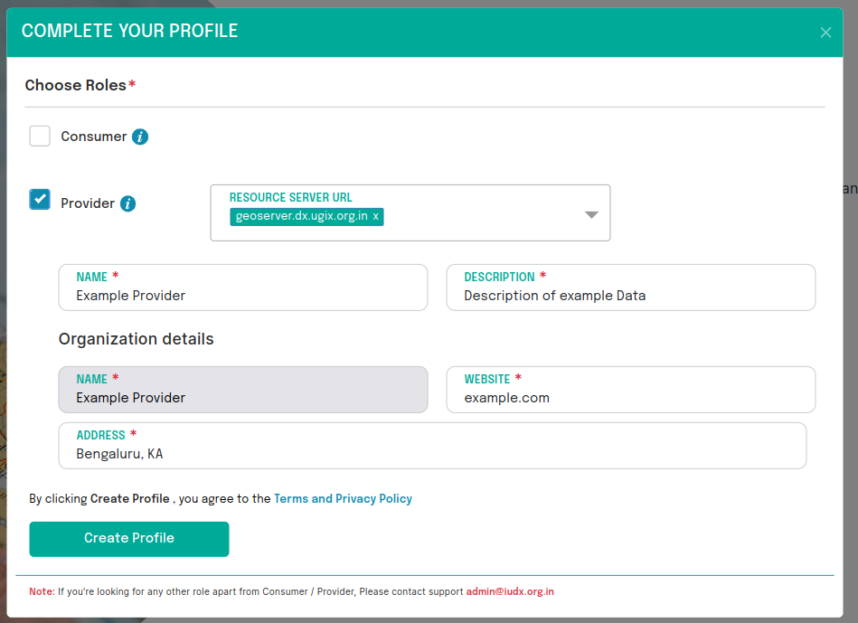
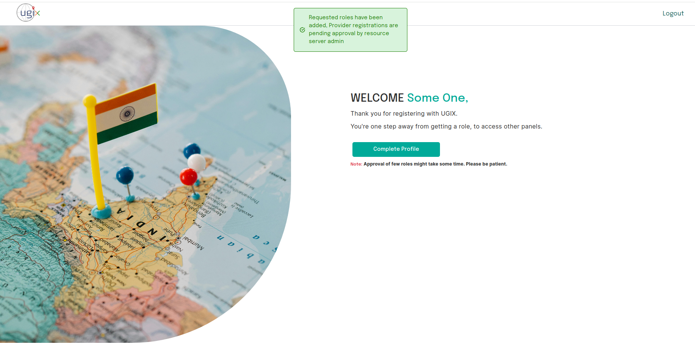

# Registration

## Introduction

All users of the UGIX platform must be registered and authenticated to perform any secure operation offered by the platform. The details of these secure operations are defined and explained by all UGIX components in their respective API documentation. The registration process of a user on the UGIX platform is a simple three-step process as outlined below:
1. [Creating the Account](#1-account-creation)
2. [Verifying the Email Address](#2-email-verification)
3. [Assigning / Requesting a User Role](#3-requesting-user-roles)

## 1. Account Creation

As the first step when a user accesses the panel, they need to register as a new user. Registering is highlighted in the picture.
 
*Click on Register*

 
*Enter Account details*

## 2. Email Verification

The user will receive an email with a verification link at their registered email address. By clicking this link, the user's account will be successfully connected to their email address.

***Note: The verification link will expire in 5 minutes.***

 
*Sample email dialog*

 
*Account created! The final registration step of selecting a role is pending.*
## 3. Requesting User Roles

Once email verification is complete, the user can choose the roles they would like to have. All roles are tied to a resource server to which the role applies. For example:

* Choosing the provider role for the resource server `rs.example.com` allows the user to upload resources to the `rs.example.com` resource server and manage access to those resources.
* Choosing the consumer role for the resource server `rs.example.com` allows the user to request access to resources on `rs.example.com` and access permitted resources on that resource server.

**NOTE: If the user chooses the consumer role, all resource servers are automatically selected, and the user will receive the consumer role for any new resource server that is added.**

 
*Choosing consumer role*

### Provider Registration

Users who require the provider role would need to give some extra information regarding the organisation they are associated with. 

**Note: Provider registration is subject to approval. A user registered with the provider role will be able to access the Provider Panel once the admin of the selected Resource Server has approved them. Providers awaiting approval may contact the point of contact in UGIX to expedite the approval process.**

 
*Choosing provider role*

 
*Successful provider registration (pending RS admin approval)*
