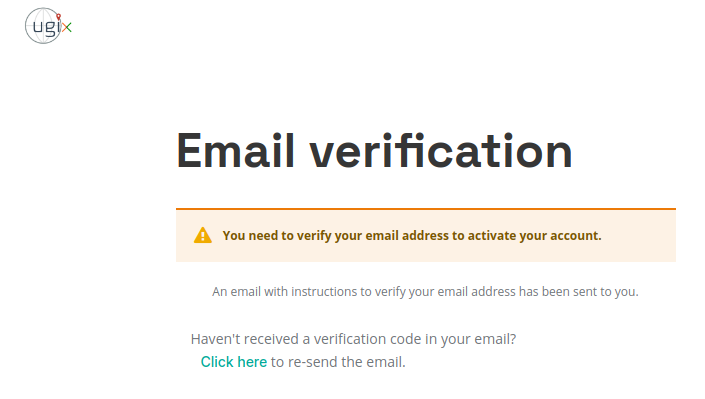

# Registration

## Introduction

All users of the UGIX platform  must be registered and authenticated to perform any secure operation offered by the platform. The details of these secure operations are defined and explained by all UGIX components in their repective API documentation. The registration process of a guest user on the UGIX platform is a simple three step process as outlined below:

1. [Creating the Account](#1-account-creation)
2. [Verifying the Email Address](#2-email-verification)
3. [Assigning / Requesting a User Role](#3-requesting-user-roles)

## 1. Account Creation

When you access the Consumer or Provider Panels, you will see an option to register when prompted to sign in.
 
*Click on Register*

 
*Enter Account details*

## 2. Email Verification

You will receive an email at your registered address containing a verification link. Once you click the link, your account will be successfully linked to your email address.
 
*Email verification required*

 
*Sample email dialog*

 
*Account created. Final registration step pending*
## 3. Requesting User Roles

Once email verification is complete, you can now choose the roles you would like to have. All roles are tied to a resource server to which the role would be applicable to. For example:
* Choosing the provider role for resource server `rs.example.com` would allow you to upload resources onto the `rs.example.com` resource server and manage access to said resources
* Choosing the consumer role for resource server `rs.example.com` would allow you to request for access for resources belonging to `rs.example.com` and access data on said resource server for permitted resources

**NOTE: If you choose the consumer role, all resource servers are automatically selected, and you will receive the consumer role for any new resource server that is added.**

 
*Choosing consumer role*

### Provider Registration

Users who require the provider role would need to give some extra information regarding the organization they are associated with. 

**NOTE: Provider registration is subject to approval. A user registered with the provider role may be able to access the Provider Panel once the admin of the Resource Server has approved them they have chosen. Providers waiting for approval may connect with the point of contact in UGIX to expedite the approval process.**
 
*Choosing provider role*

 
*Successful provider registration (pending RS admin approval)*
